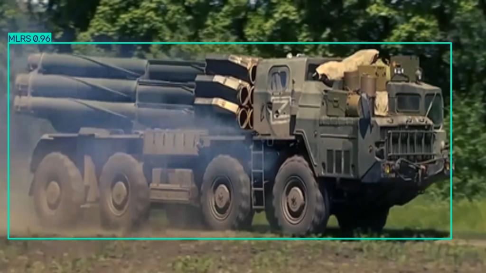
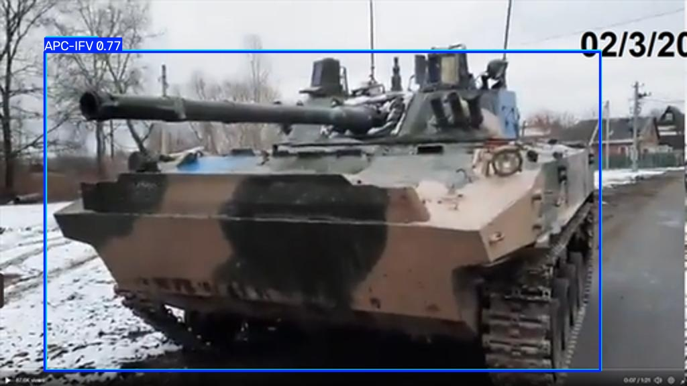
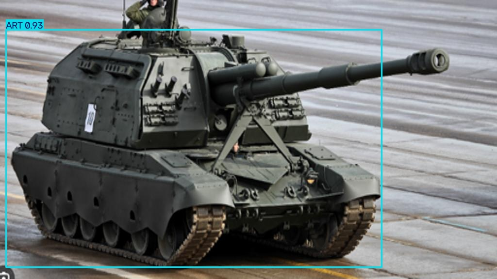
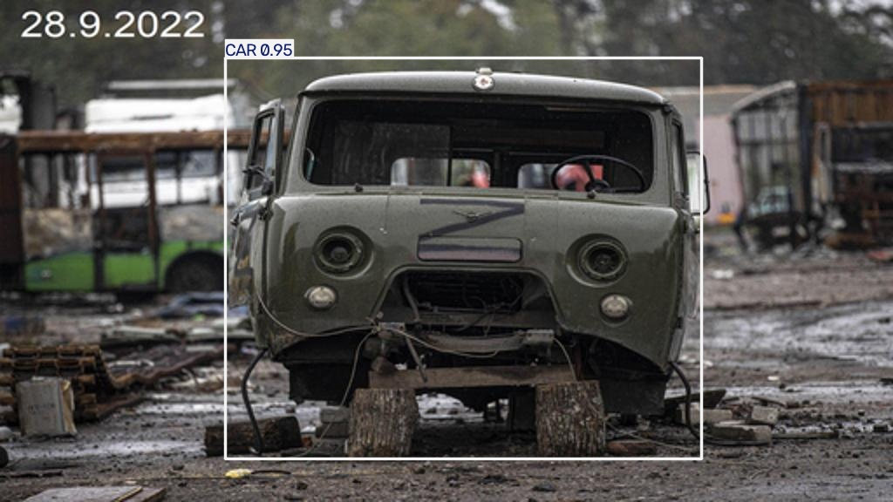
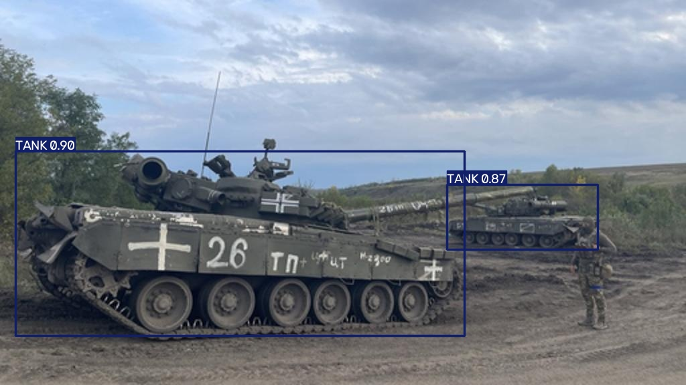
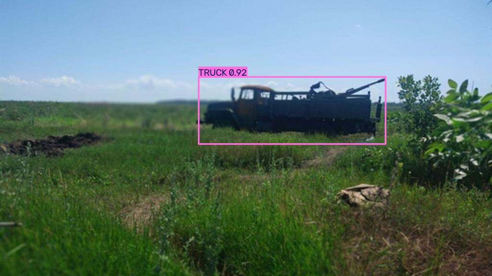
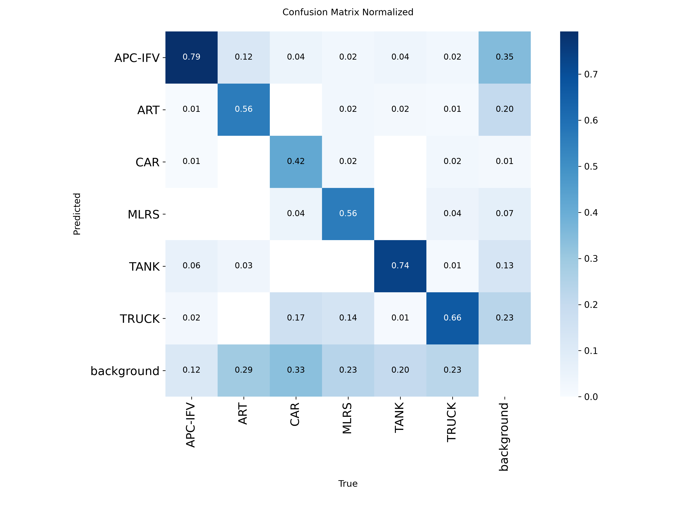

# EnemyVision — Military Vehicle Detection on Aerial Imagery

Real-time detection of military vehicles in aerial / drone imagery, built by fine-tuning **YOLOv8** on an open annotated dataset. The model localises and classifies six vehicle types and is intended as a proof-of-concept for reconnaissance and situational-awareness tasks.

> ⚠️ Educational / portfolio project. Trained only on publicly available, openly licensed data.



---

## Overview

- **Task:** object detection (bounding boxes + class + confidence)
- **Approach:** transfer learning — a pretrained YOLOv8 backbone fine-tuned on a domain-specific dataset
- **Classes (6):** `APC-IFV`, `ART` (artillery), `CAR`, `MLRS` (rocket artillery), `TANK`, `TRUCK`
- **Framework:** PyTorch (Ultralytics YOLOv8), OpenCV for I/O and post-processing
- **Hardware:** trained locally on an NVIDIA RTX 3060 (CUDA)

---

## Dataset

- **Source:** *military vehicles detection* by OJleHuHa, via [Roboflow Universe](https://universe.roboflow.com/ojlehuha-aswwb/military-vehicles-detection-0jxhy)
- **Size:** ~1,994 annotated images, YOLO format
- **Split:** 1,495 train / 399 validation / test
- **License:** **CC BY 4.0** — used with attribution.

> The dataset images are **not** redistributed in this repository. Only code, configuration and the trained weights are included. Please download the data from the original source above.

---

## Model & Training

Fine-tuned `yolov8s` for 100 epochs at 640×640, batch size 16, AdamW (auto), on a single GPU.

```python
from ultralytics import YOLO

if __name__ == "__main__":
    model = YOLO("yolov8s.pt")           # pretrained backbone
    model.train(
        data="dataset/data.yaml",
        epochs=100,
        imgsz=640,
        batch=16,
        device=0,                        # GPU
    )
```

Training converged cleanly — both training and validation losses decreased and plateaued, with no sign of overfitting.

---

## Results

Overall performance on the validation set:

| Metric        | Value  |
|---------------|--------|
| mAP@50        | 0.689  |
| mAP@50-95     | 0.500  |
| Precision     | 0.750  |
| Recall        | 0.618  |

Per-class detection quality varies with the amount of training data available:

| Class    | Notes                                            |
|----------|--------------------------------------------------|
| APC-IFV  | Strongest class — largest number of samples      |
| TANK     | Strong                                           |
| TRUCK    | Good                                             |
| ART      | Moderate                                         |
| MLRS     | Moderate — fewer samples                          |
| CAR      | Weakest — very few samples in the dataset         |

One example per class:

|  |  |  |
|:---:|:---:|:---:|
| APC-IFV | ART | CAR |
|  |  |  |
| MLRS | TANK | TRUCK |

Normalized confusion matrix (rows = predicted, columns = true class):



Training/validation curves: [`runs/detect/train/results.png`](runs/detect/train/results.png).
Full run config and per-epoch metrics: [`args.yaml`](runs/detect/train/args.yaml), [`results.csv`](runs/detect/train/results.csv).

---

## Limitations & Analysis

An honest look at where the model struggles (read from the confusion matrix):

- **Class imbalance drives accuracy.** `CAR` has by far the fewest annotated examples and is consequently the least reliable class. More data — not more training — is the main lever for improvement here.
- **False positives on background.** The model occasionally draws boxes on background textures (camouflage-like patterns, debris). This is mitigated at inference with a confidence threshold.
- **False negatives.** Some real vehicles are missed, particularly for the under-represented classes.
- **Duplicate boxes.** Overlapping detections on a single object are suppressed via Non-Maximum Suppression (`iou` threshold).

**Next steps to improve:** merge an additional dataset to balance weak classes, apply stronger data augmentation, and try a larger backbone (`yolov8m`).

---

## Usage

### 1. Install
```bash
pip install -r requirements.txt
```
(For GPU training install the CUDA build of PyTorch, e.g. `--index-url https://download.pytorch.org/whl/cu121`.)

### 2. Train
```bash
python train.py
```

### 3. Detect
```bash
python detect.py
```

`detect.py` runs the trained model on the test images, applies confidence and IoU thresholds, and saves annotated results:

```python
from ultralytics import YOLO
import os

os.makedirs("results", exist_ok=True)
model = YOLO("runs/detect/train/weights/best.pt")

results = model("dataset/test/images", conf=0.5, iou=0.5)
for i, result in enumerate(results):
    result.save(filename=f"results/detection_{i}.jpg")
```

(`detect.py` writes one file per test image; the curated examples shown
above were picked from a run over the full test set.)

---

## Project Structure
```
EnemyVision/
├── dataset/          # data.yaml + train/valid/test  (not committed — see Dataset)
├── train.py          # fine-tuning script
├── detect.py         # inference + annotation
├── results/          # one curated example image per class
└── runs/             # trained weights + training curves/confusion matrix
```

---

## Acknowledgements
- Dataset: *military vehicles detection* by OJleHuHa (Roboflow Universe), CC BY 4.0
- [Ultralytics YOLOv8](https://github.com/ultralytics/ultralytics)

## Author
**Sviatoslav Bovsunovskyi** — [GitHub](https://github.com/pewpewbs) · [LinkedIn](https://www.linkedin.com/in/sviatoslav1423/) · [Email](mailto:sviatoslav1423@gmail.com)
